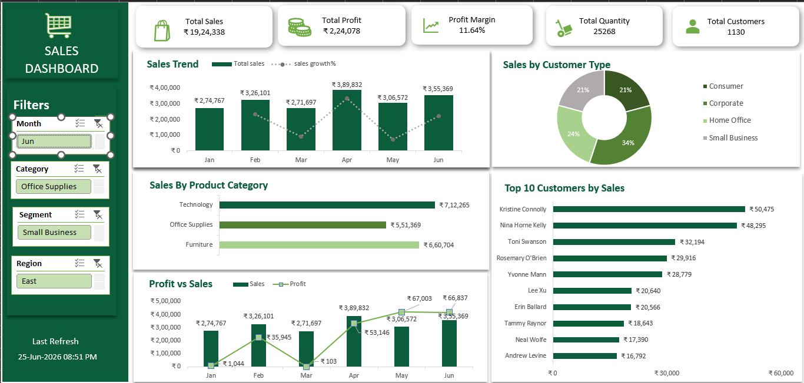

# 📊 Excel Sales Performance Dashboard

## Overview

This interactive Sales Performance Dashboard was built in Microsoft Excel to analyze sales performance, profitability, customer segments, and product categories. The dashboard enables users to explore business insights through dynamic filters and interactive visualizations.

---

## Dashboard Preview



---

## Business Objectives

- Monitor Total Sales
- Track Total Profit
- Analyze Profit Margin
- Identify Top Customers
- Compare Product Categories
- Analyze Customer Segments
- Monitor Monthly Sales Trends

---

## Tools Used

- Microsoft Excel
- Pivot Tables
- Pivot Charts
- Slicers
- Conditional Formatting
- Data Validation
- Excel Form Controls

---

## Dashboard Features

- Interactive KPI Cards
- Dynamic Filters
- Sales Trend Analysis
- Customer Segmentation
- Product Category Analysis
- Top 10 Customers
- Profit vs Sales Comparison

---

## Key Insights

- Technology generated the highest sales among product categories.
- Corporate and Consumer segments contributed the largest share of sales.
- Monthly sales trends help identify peak-performing periods.
- Top customers significantly contributed to overall revenue.

---

## Repository Structure

```
excel-sales-performance-dashboard/
│
├── Dashboard/
│   └── Sales Dashboard.xlsx
│
├── Images/
│   └── Dashboard.png
│
└── README.md
```

---

## Author

**Deeksha Poojary**

Aspiring Data Analyst

- LinkedIn: https://www.linkedin.com/in/deeksha-poojary-584423230/
- GitHub: https://github.com/Deekshapoojary
